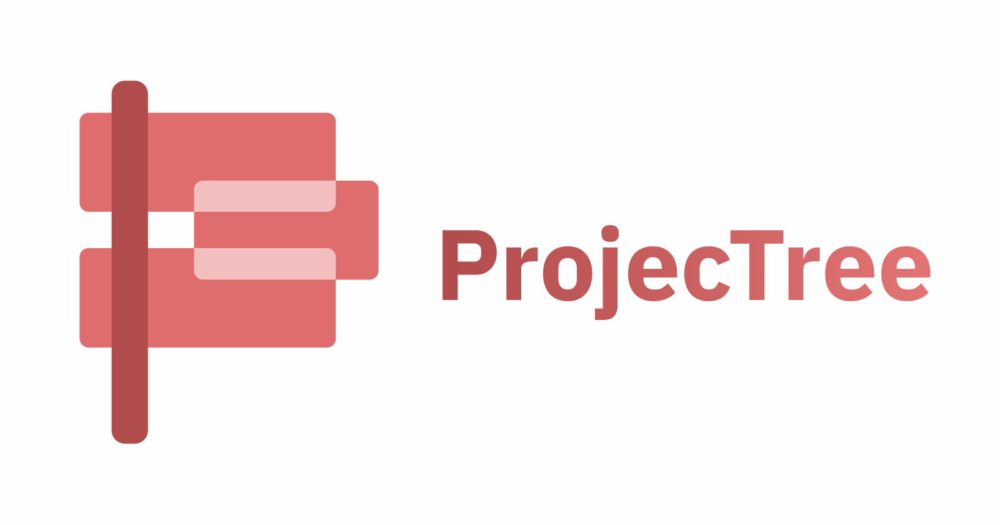

## Frontend Codebase for Projectree

[](https://app.netlify.com/sites/projectree/deploys) 
[](https://opensource.org/licenses/MIT)



# **Projectree:** Create your Project Showcases in Minutes!


# About

[**Projectree**](https://projectree.net/) is an open-source tool that helps you create and showcase your projects lists without the hassle of building it yourself. Just add your project details, choose a theme, and generate!

# Features

* Create or edit a Projectree
* Download generated Projectree to self host
* Host Projectree on site

# Roadmap

* [x] **v 0.1**
    * [x] Set up a single page application
    * [x] Develop custom frontend library
    * [x] Add readmes and licenses
    * [x] Determine database models and schemas
    * [x] Plan API routes
    * [x] Set up github repos

* [x] **v 0.2**
    * [x] Make "Create Projectree" prototype page
    * [x] Develop a standard theme for projectrees
    * [x] Allow users to download generated projectree

* [x] **v 0.3**
    * [x] Create sign up, sign in, and dashboard pages
    * [x] Make "Create Projectree" prototype page
    * [x] Deny or allow access to pages based on user authorization

* [x] **v 0.5**
    * [x] Create and style landing page, 404 page, and remaining pages
    * [x] Host frontend on Netlify

* [x] **v 0.6**
    * [x] Add meta tags for SEO
    * [x] Create page to view published projectrees
    * [x] Add privacy policy and tos pages
    * [x] Connect frontend to backend
    * [x] Add more predefined themes users can choose for their projectrees

* [ ] **v 0.7**
    * [ ] Use modals for alerts, prompts and confirms instead of browser natives
    * [ ] Allow users to upload their project images instead of using a link only
    * [ ] Add user profile dashboard
    * [ ] Allow users to reset passwords
    * [ ] Allow exporting and importing projectree drafts as json

# Prerequisites

### Netlify

To set up a development environment, install Netlify's cli through your package manager of choice:

Example:

```sh
npm install netlify-cli -g
```

# Running and Deployment

1. Clone the repo:
```sh
git clone https://github.com/danidre14/projectree-frontend.git
```

2. Configure the `netlify.toml` file with your values of choice.

As Projectree's frontend is a single page application (SPA), all unknown (404) requests should be redirected to the root `"/index.html"` file.

```
[dev]
  port = 3000

[[redirects]]
  from = "/*"
  to = "/index.html"
  status = 200
```

3. Run `netlify dev` in your local terminal to start the project locally.

Open a browser and hit `"http://localhost:3000"` or localhost at the set port in your `netlify.toml` file.

4. [Deploy](https://www.netlify.com/blog/2016/09/29/a-step-by-step-guide-deploying-on-netlify/) your frontend to netlify.

Check the [backend codebase](https://github.com/Sophyia7/projectree-backend) for documentation on the APIs.

5. Configure the `baseUrl` variable in the `/static/js/utils/makeRequest.js` file to point to where you have deployed your backend.


## Created for the [PlanetScale](https://planetscale.com/?utm_source=hashnode&utm_medium=hackathon&utm_campaign=announcement_article) x [Hashnode](https://hashnode.com/?source=planetscale_hackathon_announcement) [Hackathon](https://townhall.hashnode.com/planetscale-hackathon?source=projectree_frontend_github)
